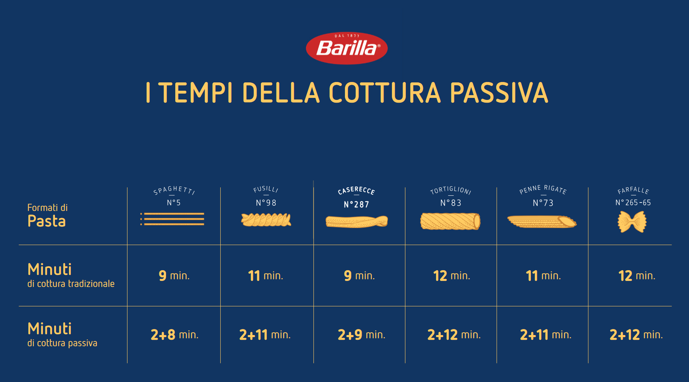
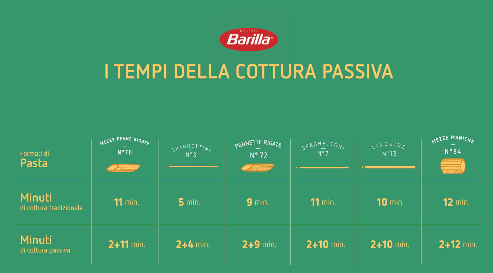
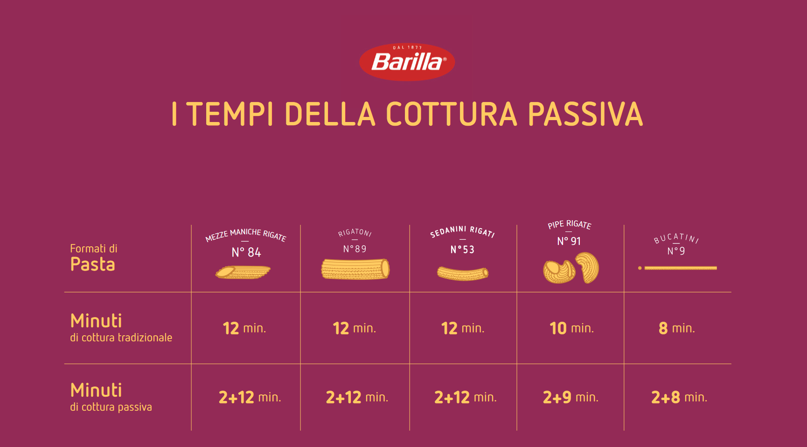

# Passive Cooker

Il Passive Cooker è uno smart device costruito assemblando una serie di elementi: un case stampato in 3D con filamento 100% biodegradabile, batterie AAA nella versione più ecologica, un sensore di temperatura e una scheda Arduino. Il dispositivo funziona dialogando con un'applicazione mobile dedicata.

## Sorgenti

I sorgenti sono presi AS IS come da distribuzione di Barilla

## Compilazione

Passive cooker utilizza 3 librerie

ArduinoBLE
QuickStats
CircularBuffer

Possono essere usate tramite installazione standard, tranne la libreria CircualBuffer.
Per poterla usare ho utilizzato l'hack suggerito nelle issue di CircularBuffer

https://github.com/rlogiacco/CircularBuffer/issues/28#issuecomment-1000541544

Questa modifica ha prodotto una distribuzione leggermente diversa che ho messo nella cartella libraries

## Progetto

Il progetto originale può essere visto qui

https://www.barilla.com/it-it/cottura-passiva

## App

L'APP da utilizzare col devide non è stata invece rilasciata in sorgente ed è disponibile a questo indirizzo https://play.google.com/store/apps/details?id=com.passivecooker

## Technique

Di seguito l'elenco dei tempi di cottura per la posta Barilla

